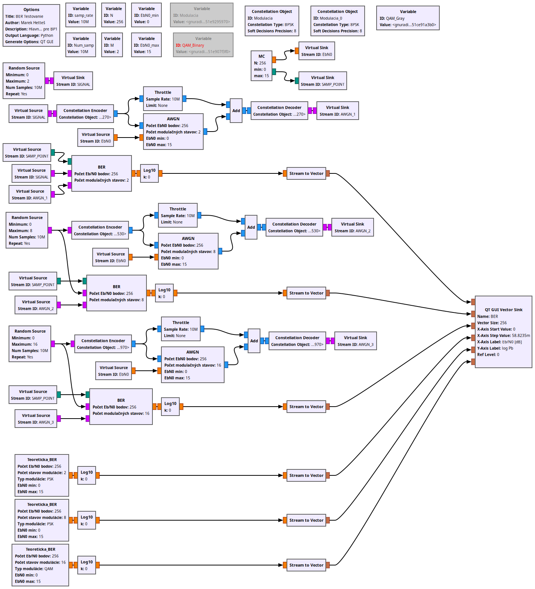
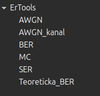

# Návrh a implementácia testovacieho prostredia pre vizualizáciu a hodnotenie SDR komunikácie v reálnom čase na platforme GNU Radio - Bakalárska práca 2025/2026

- Dokument: moja dokumentacia projektu
- Flowgraphs: flowgraphy, na ktorych skusam svoje bloky
- Projekt: tu sa nachazaju vsetky moje moduly spolu s OOT, konkretne v gr_ErTool/lib/ BER, SER, Teoreticka_BER, MC a AWGN
- Testing: vsetky moje testovacie C a C++ kody, vacsinou na tvorbu algoritmov, ktore pouzivam

## Schéma zapojenia (Flowgraph)

## Výstup z flowgraphu = simulácia + teória

## Zobrazenie blokov v bočnej knižnici

